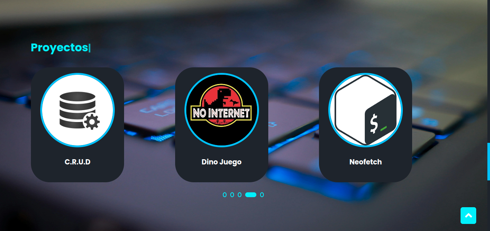
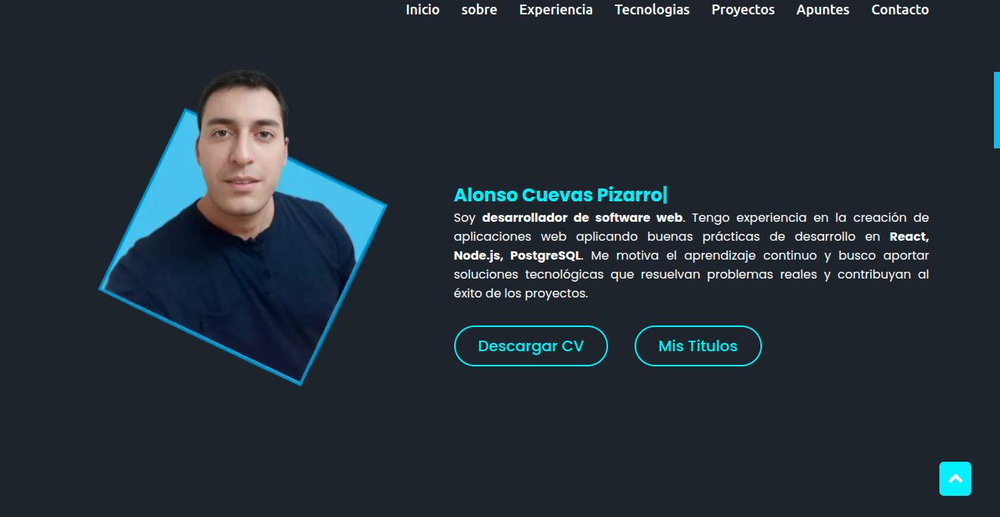
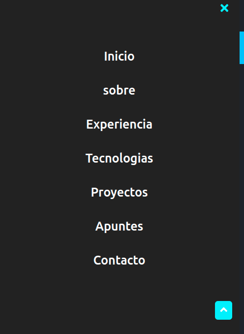

# 🌐 Portafolio Web de Alonso Cuevas

Portafolio profesional desarrollado para presentar mi experiencia laboral, tecnologías utilizadas y proyectos personales/profesionales desplegados en distintas plataformas web.

El sitio funciona como una vitrina digital donde los visitantes pueden explorar proyectos interactivos, revisar experiencia profesional y acceder a diferentes demostraciones desplegadas en servicios como GitHub Pages, Render y Vercel.

---

## 📸 Vista General

Este proyecto incluye:

- Presentación profesional
- Experiencia laboral
- Stack tecnológico
- Carrusel de proyectos interactivos
- Acceso a CV y certificados
- Formulario de contacto
- Integración con redes profesionales






---

# 🚀 Características

- Diseño responsive
- Navegación suave entre secciones
- Animaciones dinámicas con Typed.js
- Carrusel interactivo de proyectos
- Integración con EmailJS
- SEO básico implementado
- Open Graph y Twitter Cards configuradas
- Despliegue estático optimizado para GitHub Pages

---

# 🛠️ Tecnologías Utilizadas

## Frontend

- HTML5
- CSS3
- JavaScript
- jQuery

## Librerías y Plugins

- Typed.js
- OwlCarousel2
- Font Awesome
- Boxicons
- Devicon
- EmailJS
- Waypoints

---

# 📂 Estructura del Proyecto

```bash
dev/
├── .vscode/
│   └── settings.json
├── adjunto/
├── images/
├── titulos/
│   ├── certificados/
│   ├── images/
│   ├── dev2.webp:Zone.Identifier
│   ├── index.html
│   ├── script.js
│   └── style.css
├── README.md
├── adjunto.docx
├── index.html
├── robots.txt
├── script.js
├── sitemap.xml
└── style.css
```

---

# 🧠 Funcionalidades Principales

## 📌 Sección Inicio

Presentación principal con efecto de escritura animada y navegación rápida hacia contacto.

## 👨‍💻 Sobre Mí

Descripción profesional orientada al desarrollo de software web y acceso directo a:

- Curriculum Vitae
- Certificados y títulos

## 💼 Experiencia Laboral

Experiencia en desarrollo Full Stack trabajando en:

- Sistemas empresariales
- Plataformas de incidencias
- Soluciones web
- Optimización de interfaces móviles

## ⚙️ Tecnologías

Visualización organizada de:

- Lenguajes
- Frameworks
- Bases de datos
- Herramientas de desarrollo

## 🧩 Proyectos

Carrusel interactivo con proyectos desplegados y demostraciones funcionales.

Incluye proyectos como:

- CRUD Web
- Ticket de Avión
- Sistema Bancario
- Juego Dino
- Neofetch Web
- Aplicación de Apuntes
- Simuladores
- Proyectos académicos

## 📬 Contacto

Formulario funcional conectado mediante EmailJS para recepción de mensajes sin backend.

---

# 🌍 Deploy

Actualmente desplegado en:

- GitHub Pages

---

# 🗄️ Base de Datos

Este proyecto:

- No utiliza base de datos
- No requiere backend
- No utiliza archivos `.env`

---

# 📦 Instalación y Uso

Como es un proyecto estático, solo necesitas clonar el repositorio y abrir el archivo principal.

```bash
git clone https://github.com/alonsocuevas/dev.git
```

Luego abre:

```bash
index.html
```

También puedes usar extensiones como:

- Live Server (VSCode)

---

# 🔧 Configuración

No requiere:

- Node.js
- package.json
- npm
- yarn
- variables de entorno

Todo funciona directamente desde archivos estáticos HTML, CSS y JavaScript.

---

# 📈 SEO Implementado

El proyecto incluye:

- Meta etiquetas
- Open Graph
- Twitter Cards
- robots.txt
- sitemap.xml
- Etiquetas semánticas
- Optimización para compartir enlaces

---

# 📱 Responsive Design

El portafolio fue desarrollado para funcionar correctamente en:

- Escritorio
- Tablets
- Dispositivos móviles

---

# 🔐 Integraciones Externas

El proyecto consume recursos externos desde CDN:

- jQuery CDN
- Font Awesome CDN
- OwlCarousel CDN
- Typed.js CDN
- EmailJS CDN

---

# 📄 Licencia

Este proyecto fue desarrollado como portafolio personal y vitrina profesional.

Uso personal y educativo.

---

# 👨‍💻 Autor

## Alonso Cuevas Pizarro

Desarrollador de Software Web enfocado en:

- React
- Node.js
- PostgreSQL
- Docker
- Desarrollo Full Stack

---

# 🔗 Enlaces

## GitHub

```txt
https://github.com/alonsocuevas
```

## LinkedIn

```txt
https://www.linkedin.com/in/alonso-cuevas-pizarro-b2066434a/
```

## Portafolio

```txt
https://alonsocuevas.github.io/dev/
```